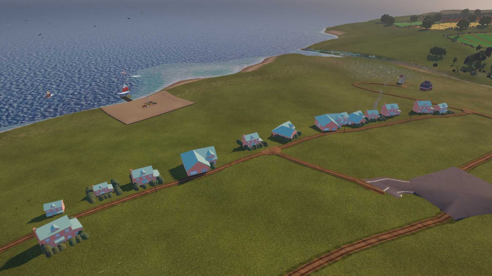
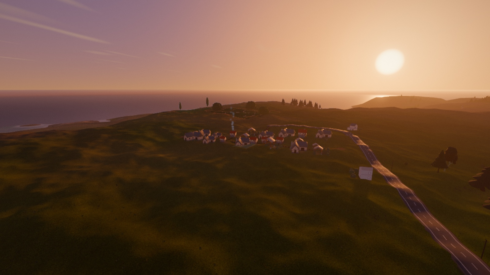
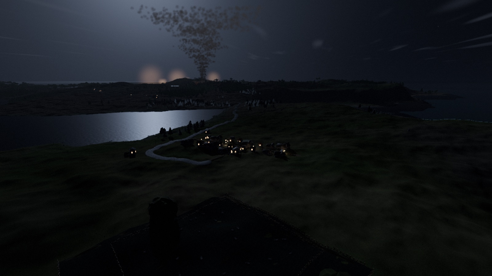
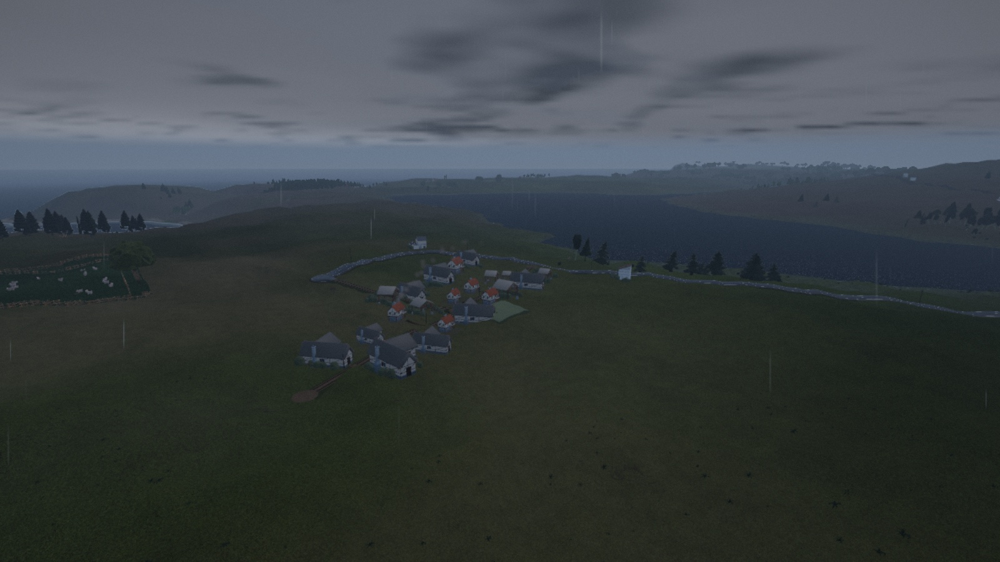
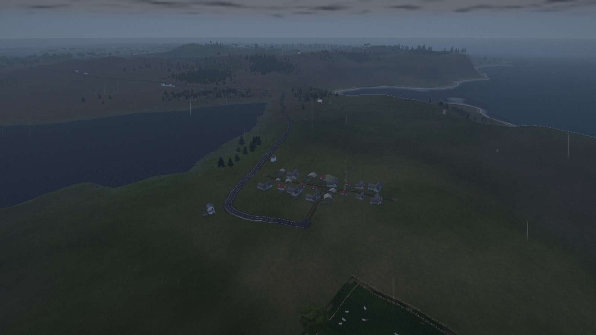
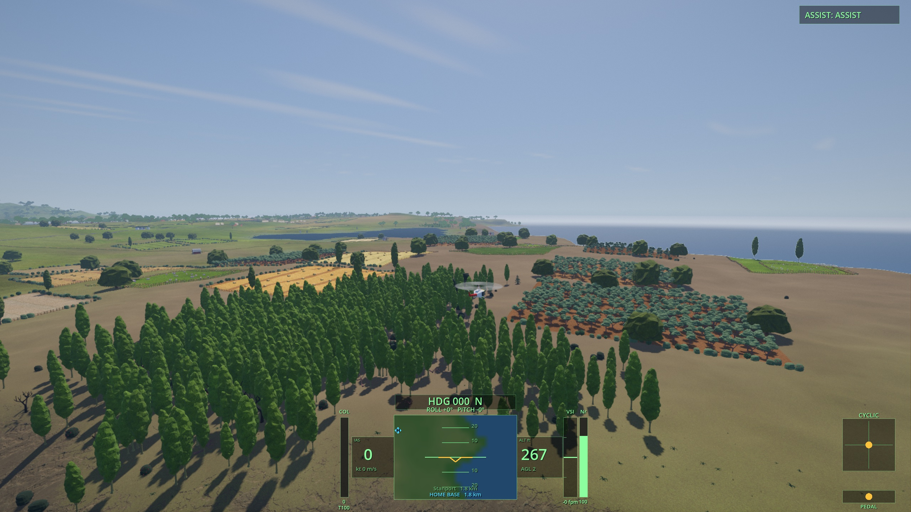
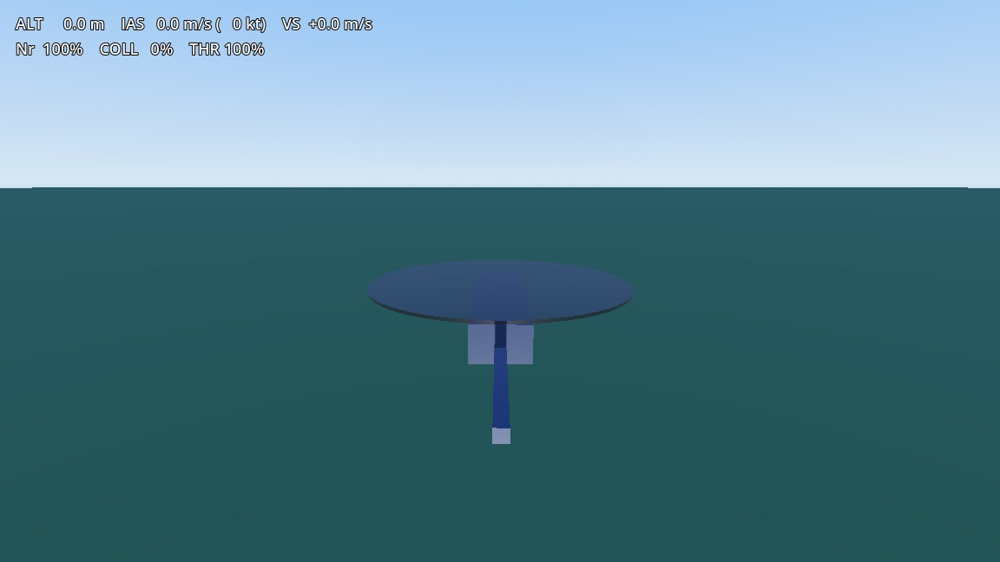
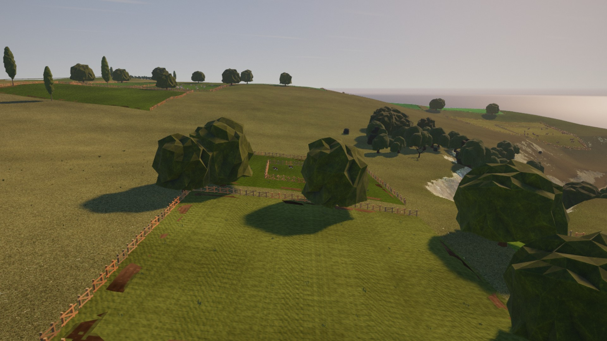

# Rotorwash

A helicopter sim built on a real blade-element flight model, over a procedurally
generated island. Free, no installer, macOS and Windows.

## Download

**[→ Get the latest build](../../releases/latest)**

| Platform | Notes |
|---|---|
| **macOS** | Universal — Apple Silicon and Intel. Needs macOS 11+. |
| **Windows** | 64-bit. |

Neither build is code-signed (that costs money I haven't spent), so your OS will
complain the first time:

- **macOS** — double-click, click *Done* on the warning, then go to
  **System Settings → Privacy & Security**, scroll to the *Security* section, and
  click **Open Anyway**. (Right-click → Open no longer works on modern macOS.)
- **Windows** — SmartScreen will pop up. Click **More info → Run anyway**.

## Controls

Everything is keyboard. The collective is a **lever that stays where you put it**;
cyclic and pedals are **spring-centred** and only act while held.

### Flying

| Key | Does |
|---|---|
| **W** / **S** | Collective up / down — total rotor lift. This is the big one. |
| **↑** / **↓** | Cyclic fore / aft — nose down / nose up. |
| **←** / **→** | Cyclic left / right — roll. |
| **Q** / **E** | Pedals — yaw the nose left / right. |
| **X** *(hold)* | Cut the throttle. Autorotation practice. |
| **Tab** | Cycle the assist: off → SAS → full assist. |
| **R** | Respawn after a crash. |

### Camera

| Input | Does |
|---|---|
| **Right-mouse + drag** | Look around from the chase camera. |
| **Mouse wheel** | Zoom in / out. |

### World & display

| Key | Does |
|---|---|
| **Esc** | Pause / settings — graphics, assists, HUD, world seed. |
| **M** | World map. |
| **N** | Night vision. |
| **,** / **.** | Scrub time of day (a full day in about six seconds). |
| **[** / **]** | HUD size. |
| **-** / **=** | Render scale — the main performance lever. |
| **`** | Performance overlay. |

## Getting off the ground

Hold **W**. Nothing happens until the collective passes roughly 71% — that is
where lift finally beats weight. Then it climbs, and immediately starts to drift
and tip, because a real helicopter is unstable and this one is modelled that way.
Tap the arrow keys in small inputs to keep it level.

If that is miserable, hit **Tab** for the stability assist while you learn.

## What's actually in here

- A **blade-element flight model** written in Rust — the rotor is integrated
  across blade sections rather than faked with a lift curve. Hover figure of
  merit 0.70, a correct power-required bucket from 0–140 kt, correct control
  response signs, and a realistic autorotation entry, all validated against
  published rotor aerodynamics (Leishman, Prouty, Padfield, Johnson, NASA TRS).
- A **procedural island**, generated entirely from a seed: terrain, rivers and
  lakes with real drainage, farmland, forests, villages and towns placed by a
  settlement census, roads with junctions and bridges, boats, livestock, birds.
- **Living weather**: the sky drifts between clear, hazy and overcast — and
  sometimes keeps going. Rain squalls roll in over a couple of minutes: the deck
  seals and darkens, rain curtains hang on the horizon, and then you're in it —
  rain past the canopy, the ground soaking dark and glossy, the sea flattened to
  pewter and dancing with raindrop rings. Storms bring lightning, with thunder
  that arrives late from far-off strikes. When the squall moves through, the
  island stays wet and glistening for a few minutes while it dries out.
- A **day/night cycle** on a moving sun and moon. Sunrise and sunset put the warm
  band where the sun actually is, the sea takes a glitter road from whichever one
  is up, and after dark the island goes properly dark — village windows and street
  lamps become the only warm light in the frame, and the moon is bright enough to
  fly by.
- **Positional audio** (the rain and thunder are synthesized live, like everything
  else you hear), and a full instrument HUD with a moving map.

Change the seed in the settings menu and you get a completely different island.
The default map is a compact one where you can see the whole coast at once;
there are bigger ones in there too, and they are less finished.

## About this project — the honest version

I'm a developer. I am **not** a game developer. I had never written a line of
Godot, a shader, or a flight model before this.

This is, frankly, somewhat vibe coded. It was built almost entirely in
collaboration with AI, as an experiment to see how far AI could carry a
developer with no game-development background — how far past "toy demo" it could
actually get before falling over.

I think the answer is genuinely interesting, which is why it's here. The physics
is real and validated. The world still has a way to go on believability, and I
know it. Some of it is beautiful and some of it is obviously fake.

### Where this started

Day one — 30 June 2026. The flight model underneath was already real and
validated; this is everything that sat on top of it. A box, a rotor disk on a
stick, a two-line text HUD, and a flat plane to sit on:

Every other picture on this page is the same project about two months later.

## Tell me what you think

Ideas, advice, criticism — all welcome, and the harsher the more useful.
**[Open an issue](../../issues)** and tell me what's wrong with it, what feels
fake, or what you'd want to do in a world like this.

The source is currently private. If there's interest in seeing it, ask.

---

Built with [Godot 4.7](https://godotengine.org), [godot-rust](https://godot-rust.github.io),
and [Terrain3D](https://github.com/TokisanGames/Terrain3D).
