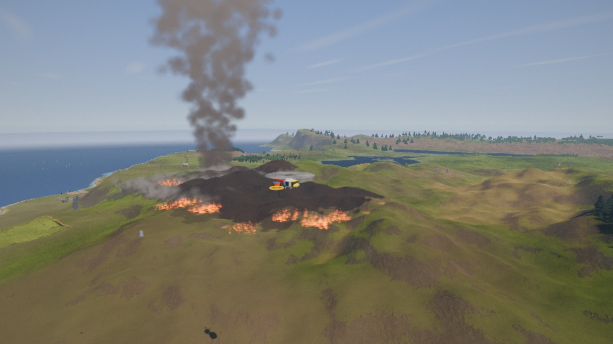
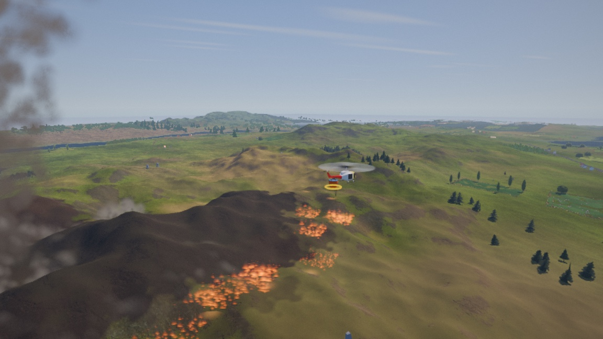
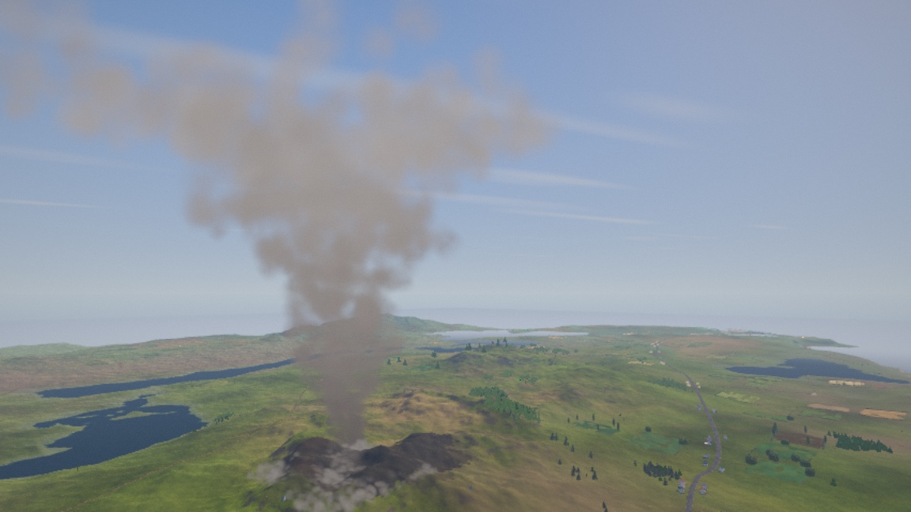

# Rotorwash

A helicopter sim built on a real blade-element flight model, over a procedurally
generated island. Free, no installer, macOS and Windows.

## Download

**[→ Get the latest build](../../releases/latest)**

| Platform | Notes |
|---|---|
| **macOS** | Universal — Apple Silicon and Intel. Needs macOS 11+. |
| **Windows** | 64-bit. |

Neither build is code-signed (that costs money I haven't spent), so your OS will
complain the first time:

- **macOS** — double-click, click *Done* on the warning, then go to
  **System Settings → Privacy & Security**, scroll to the *Security* section, and
  click **Open Anyway**. (Right-click → Open no longer works on modern macOS.)
- **Windows** — SmartScreen will pop up. Click **More info → Run anyway**.

## Controls

The collective is a **lever that stays where you put it**; cyclic and pedals are
**spring-centred** and only act while held.

**Use a controller if you have one.** A helicopter is four continuous axes and a
keyboard has none of them — every key is fully on or fully off, so on the arrow
keys you are metering the cyclic by counting milliseconds. Any Xbox, PlayStation
or generic pad is picked up automatically at launch, with nothing to configure.
On a Mac, hold the small pair button on the top edge of an Xbox controller until
the logo flashes, then add it under **System Settings → Bluetooth** (or just plug
it in with USB-C).

### Flying — controller

| Input | Does |
|---|---|
| **Left stick ↑ / ↓** | Collective. The stick is spring-centred, so it *moves* the lever rather than being it: push and hold to raise it, let go and it stays. |
| **Right stick** | Cyclic. Fore/aft pitches, left/right rolls. |
| **Left stick ← / →** | Pedals — yaw the nose. |
| **LT** / **RT** | Pedals as well, if you would rather fly the yaw on the triggers. |
| **A** | Take / return the water bucket. |
| **X** | Drop the water. |
| **Y** | Accept a cargo contract. |
| **B** | Jettison the load. |
| **LB** *(hold)* | Look down at the slung load. |
| **Start** | Cycle the assist. |
| **Back** | Respawn. |

The sticks have a dead band and an expo curve, so the middle of the travel —
where a hover is actually flown — is far finer than the ends, while the stops
still give you full authority.

### Flying — keyboard

| Key | Does |
|---|---|
| **W** / **S** | Collective up / down — total rotor lift. This is the big one. |
| **↑** / **↓** | Cyclic fore / aft — nose down / nose up. |
| **←** / **→** | Cyclic left / right — roll. |
| **Q** / **E** | Pedals — yaw the nose left / right. |
| **X** *(hold)* | Cut the throttle. Autorotation practice. |
| **Tab** | Cycle the assist: off → SAS → full assist. (Fun mode is opt-in from Settings and Tab cannot reach it.) |
| **R** | Respawn after a crash. |

### The job

| Key | Does |
|---|---|
| **F** | Accept the cargo contract offered on the pad you are stood on. |
| **J** | Jettison the slung load. |
| **B** | Take or return the water bucket — you must be **landed on a pad**. |
| **G** | Drop the water. |
| **C** *(hold)* | Hook view: look down at the load and the ground under it. |

### Camera

| Input | Does |
|---|---|
| **Right-mouse + drag** | Look around from the chase camera. |
| **Mouse wheel** | Zoom in / out. |

### World & display

| Key | Does |
|---|---|
| **Esc** | Pause / settings — graphics, assists, HUD, world seed. |
| **M** | World map. |
| **N** | Night vision. |
| **,** / **.** | Scrub time of day (a full day in about six seconds). |
| **[** / **]** | HUD size. |
| **-** / **=** | Render scale — the main performance lever. |
| **`** | Performance overlay. |

## Getting off the ground

Hold **W**. Nothing happens until the collective passes roughly 71% — that is
where lift finally beats weight. Then it climbs, and immediately starts to drift
and tip, because a real helicopter is unstable and this one is modelled that way.
Tap the arrow keys in small inputs to keep it level.

If that is miserable, hit **Tab** for the stability assist while you learn.

### Flying with a kid — Fun mode

I fly this with my 8-year-old and we both found it too twitchy, so there is now
a fourth assist level in **Settings → Assist** called **Fun (kid mode)**. It is a
different control law, not a stronger version of the same one:

- The **right stick is where the helicopter points.** Stick position *is* the
  bank angle and *is* the dive angle, and the command is rate-limited so a
  slammed stick swoops instead of snapping.
- The **left stick is altitude.** Up is up, down is down, centre holds the
  height you are at.
- **Turns carve.** Bank it and the nose comes round on its own, on the proper
  coordinated rate, with the collective easing up so the turn holds its height
  instead of sagging out of it.
- **It is forgiving, not invincible.** No rolling inverted, no settling with
  power, no running the tail rotor out of authority. The ground is the exception
  on purpose: let go of the controls and you are safe, but hold the descend
  control all the way down and you will put it into the dirt. A mode you cannot
  crash is a mode where the controls stop meaning anything.

Tip past about 30 degrees and it commits — the speed cap opens and you get a
proper dive, then pull back and zoom.

It is not on rails. The same blade-element flight model is still underneath, so
the machine still has weight and still lags behind you; that is deliberate,
because without inertia there is nothing to carve. Tab cannot reach Fun mode or
leave it, so a kid mashing buttons cannot fall out of it by accident.

## What's actually in here

- **Something to do.** Set down on a friendly pad and it offers you a load for a
  named settlement — fly it there and put it down in the landing zone beside the
  place. The cargo has real weight, and the weight is the flight model's, not a
  number in a menu: a heavy load wants more collective to hover, more pedal to
  hold heading, and will not come off the ground in a hover at all, so you learn
  to run it on. Put it down harder than about 1.6 m/s and you break the freight
  well before you break the aircraft, and only what arrives intact counts.
- **Fuel that means something.** Burn is priced against the power the engine is
  actually delivering, so a hover drinks about twice a cruise and a heavy load
  costs you range. The gauge tells you minutes remaining at the power you are
  drawing right now, which is the only honest answer to "can I get home". Run the
  tank dry and the engine just stops — you are in an autorotation, and the landing
  is still yours to make.
- A **blade-element flight model** written in Rust — the rotor is integrated
  across blade sections rather than faked with a lift curve. Hover figure of
  merit 0.70, a correct power-required bucket from 0–140 kt, correct control
  response signs, and a realistic autorotation entry, all validated against
  published rotor aerodynamics (Leishman, Prouty, Padfield, Johnson, NASA TRS).
- A **procedural island**, generated entirely from a seed: terrain, rivers and
  lakes with real drainage, farmland, forests, villages and towns placed by a
  settlement census, roads with junctions and bridges, boats, livestock, birds.
- **Living weather**: the sky drifts between clear, hazy and overcast — and
  sometimes keeps going. Rain squalls roll in over a couple of minutes: the deck
  seals and darkens, rain curtains hang on the horizon, and then you're in it —
  rain past the canopy, the ground soaking dark and glossy, the sea flattened to
  pewter and dancing with raindrop rings. Storms bring lightning, with thunder
  that arrives late from far-off strikes. When the squall moves through, the
  island stays wet and glistening for a few minutes while it dries out.
- A **day/night cycle** on a moving sun and moon. Sunrise and sunset put the warm
  band where the sun actually is, the sea takes a glitter road from whichever one
  is up, and after dark the island goes properly dark — village windows and street
  lamps become the only warm light in the frame, and the moon is bright enough to
  fly by.
- **A wildfire, and a bucket to fight it with.** Fire spreads on the fuel that is
  really under it — it runs about ten times faster uphill than down and four times
  faster downwind than up, and open water stops it dead. Take the bucket from a
  pad, hover until it is in a lake or the sea to fill it, then lay 900 kg of water
  on the burning edge. One drop will not kill a canopy fire, so you will be
  shuttling, and the round trip to the nearest water is the decision the sortie is
  really about. Ground that has burnt goes black, and the trees standing in it
  char.
- **Positional audio** (the rain and thunder are synthesized live, like everything
  else you hear), and a full instrument HUD with a moving map.

The fire and its smoke are drawn from the same numbers the simulation runs on.
The sim carries Byram's fireline intensity — how many kilowatts per metre of
front the fire is actually putting out — and the flames read it: their length,
how deep the burning band is, and how far they lean downwind all come out of
that one quantity. So a grass fire lies over at about 46 degrees with flames a
metre or two high, a crown fire stands nearly upright with ten-metre ones, and
the slow-moving back edge of a fire draws visibly shorter flames than the head
racing away from it.

The column rises the way a real convection column does, its updraft set by the
fire's own heat output, so a big fire punches a plume that a small one cannot.

Change the seed in the settings menu and you get a completely different island.
The default map is a compact one where you can see the whole coast at once;
there are bigger ones in there too, and they are less finished.

## About this project — the honest version

I'm a developer, and a bad one at that. I am **not** a game developer. I had
never written a line of Godot, a shader, or a flight model before this.

This is, frankly, somewhat vibe coded. It was built almost entirely in
collaboration with AI, as an experiment to see how far AI could carry a
developer with no game-development background — how far past "toy demo" it could
actually get before falling over.

I think the answer is genuinely interesting, which is why it's here. The physics
is real and validated. The world still has a way to go on believability, and I
know it. Some of it is beautiful and some of it is obviously fake.

In that spirit: **if you downloaded v0.7.0, v0.7.1 or v0.7.2, the wildfire never
actually started.** The only code path that lit a fire was behind a developer
environment variable, so three releases advertised a feature on this page that no
player could reach. That is fixed in v0.8.0 and it is the kind of thing worth
saying out loud rather than quietly correcting.

Smoke was the worst thing in the game for three releases, and the reason turned
out to be a single number. Rendering the plume and staring at it got nowhere; I
had to go and measure it. Integrating the plume's own motion equations and
counting how many sprites actually overlap at each height gave this:

    30 m up: 0.13    150 m up: 0.14    400 m up: 0.13

One sprite contributes 0.13. So the column was exactly **one sprite thick**, from
the fire to the top — a handful of separated puffs strung through 600 m of sky,
which is why it read as scattered specks and not as smoke. Nothing about the
colour, the texture or the fade was ever going to fix that.

The fix is not a prettier puff. Optical depth works out to `fill × alpha ÷
footprint`, so at a fixed rendering budget the only free variable is how WIDE the
plume is spread. Narrowing it — the eddies, not the wind, turned out to be what
was smearing it 500 m across — bought about nine times the density for nothing.
Then the sprites got smaller and there are now five times as many of them, which
is the same lesson the rotorwash dust taught this project a month earlier: a
metre-scale sprite is an *object*, and objects cannot pile up into a *medium*.
It costs 1.5x the fill of the version that did not work.

Then the flames got the same treatment, and the verdict on the old ones was
blunt: *"what small fires would look like if they were HUGE."* Exactly right.
Every 32 m cell was drawing one smooth symmetric mound — a campfire's silhouette,
scaled up. A campfire is a point source; a wildfire is a *line*, deeper than it
is tall, leaning downwind. It is now built that way, and the numbers behind it
come out of the fire-behaviour literature rather than out of my eye.

The best bug of the pass was found by the same person squinting at a screenshot
and asking why part of the smoke was missing. It was: the ocean is a 16 km
transparent plane, and without a render priority it sorted as nearer than the
plume and painted over it wherever sea was behind the smoke. That had been true
of everything transparent seen against open water, including the spray under the
aircraft during a bucket dip.

### Where this started

Day one — 30 June 2026. The flight model underneath was already real and
validated; this is everything that sat on top of it. A box, a rotor disk on a
stick, a two-line text HUD, and a flat plane to sit on:

Every other picture on this page is the same project about two months later.

## Tell me what you think

Ideas, advice, criticism — all welcome, and the harsher the more useful.
**[Open an issue](../../issues)** and tell me what's wrong with it, what feels
fake, or what you'd want to do in a world like this.

The source is currently private. If there's interest in seeing it, ask.

---

Built with [Godot 4.7](https://godotengine.org), [godot-rust](https://godot-rust.github.io),
and [Terrain3D](https://github.com/TokisanGames/Terrain3D).
